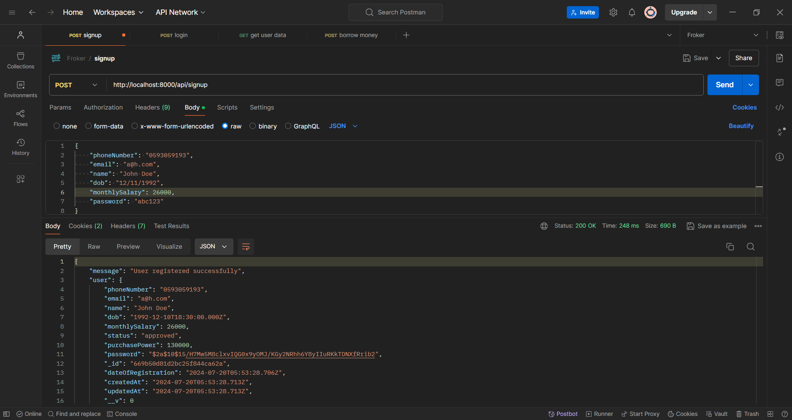
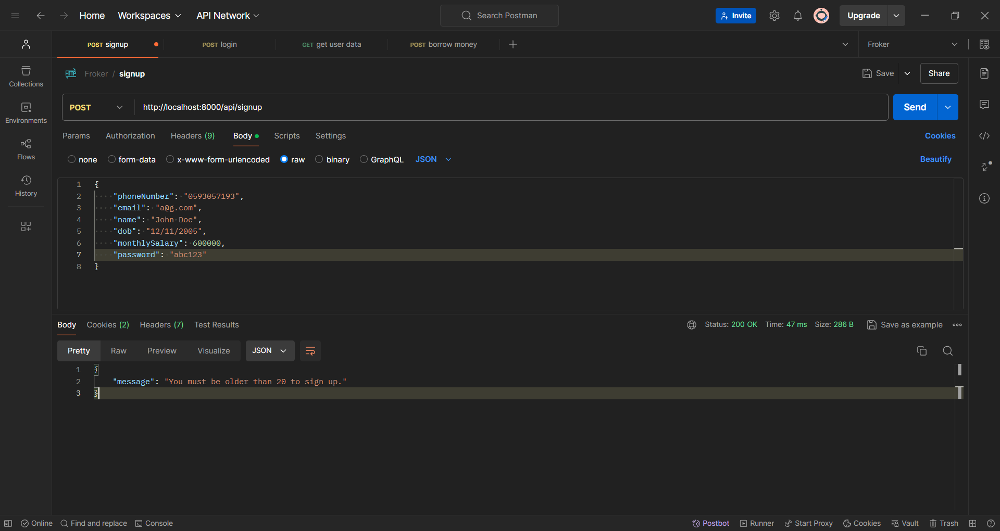
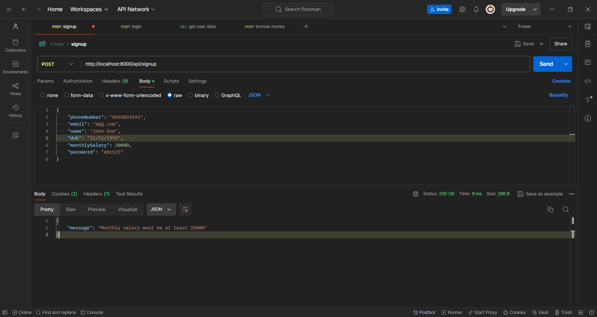
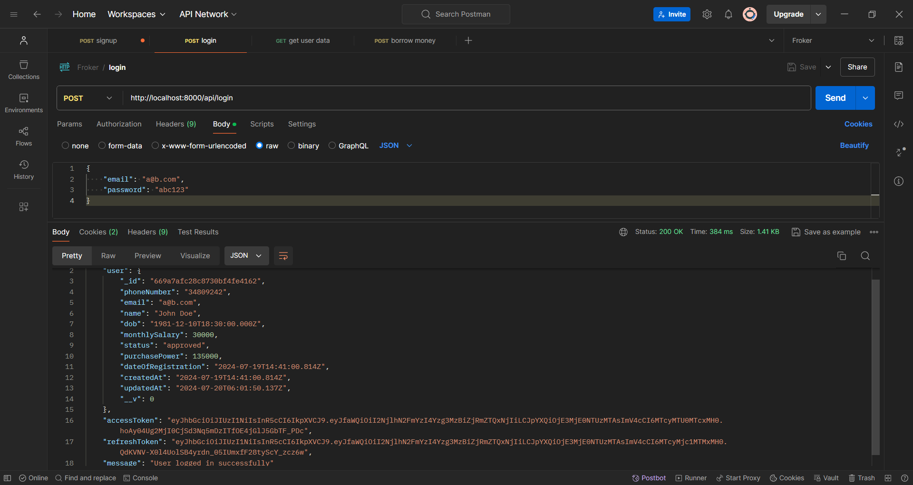
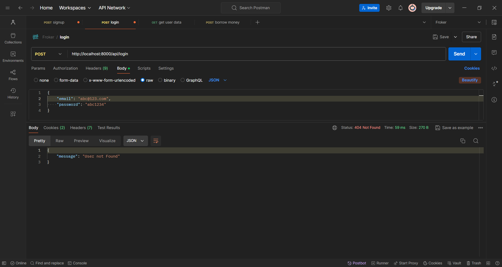
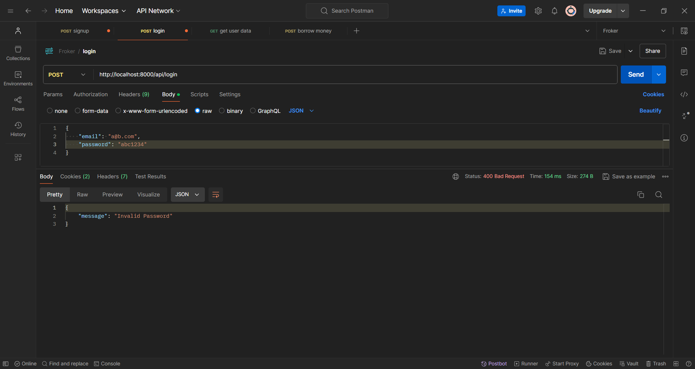
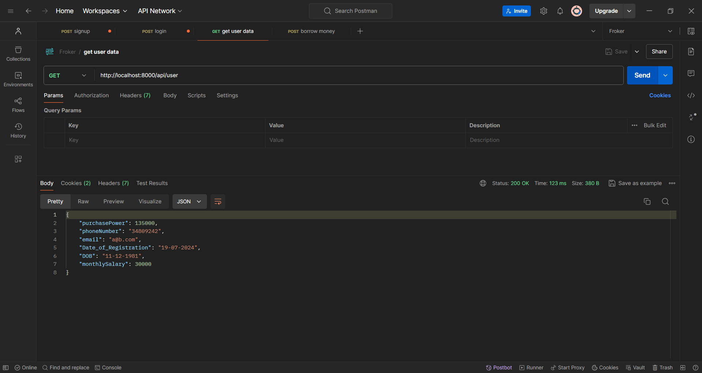
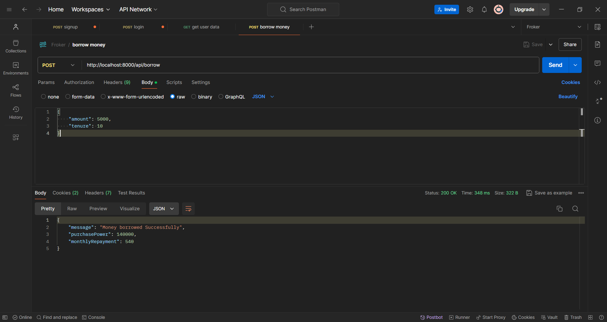

# Money Lending App

## Overview

This project is a backend for a money lending application, similar to apps like Slice and KreditBee. The backend is built using Node.js, Express, and MongoDB. It includes four main APIs for user signup, login, showing user data, and borrowing money.

## Prerequisites

- NodeJs
- MongoDB

## Installation

### 1. Install the Dependencies

```bash
npm Install
```

### 2. Setup MongoDB

Ensure MongoDB is running on your machine

### 3. Environment Variables

To run this project, you will need to add the following environment variables to your .env file

`MongoDB URI`

`JWT Secret`

## API Endpoints

### Signup

Endpoint `POST /api/signup`

Functionality:

- Approves or rejects the application based on user age and monthly salary.
- Registers the user after all verification.
- Maintains a status field to handle the user application status.

Validation Criteria:

- User should be above 20 years of age
- User should have at least 25000 monthly salary

### Succesful SignUp



### SignUp fail due to Age Error



### SignUp fail due to Salary Error



### Login

Endpoint `POST /api/login`

Functionality:

- Allows the user to log in using email and password.
- Uses JWT for authentication.

### Succesful Login



### Login failed when user not found



### Login failed with invalid password



### Get User Data

Endpoint `POST /api/user`

Functionality:

- Shows user data as per the requirement

used a middleware to ensure authorization using JWT token



### Borrow Money

Endpoint `POST /api/borrow`

Functionality:

- Allow the user to borrow money from the application.

used a middleware to ensure authorization using JWT token


